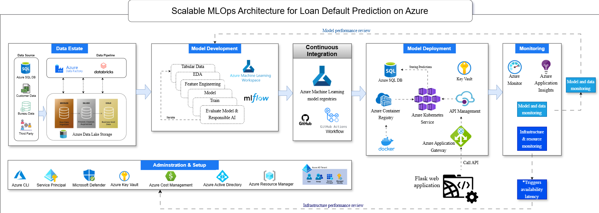
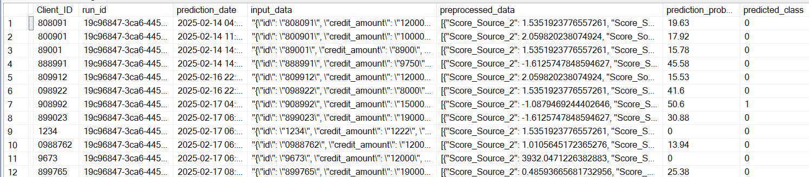
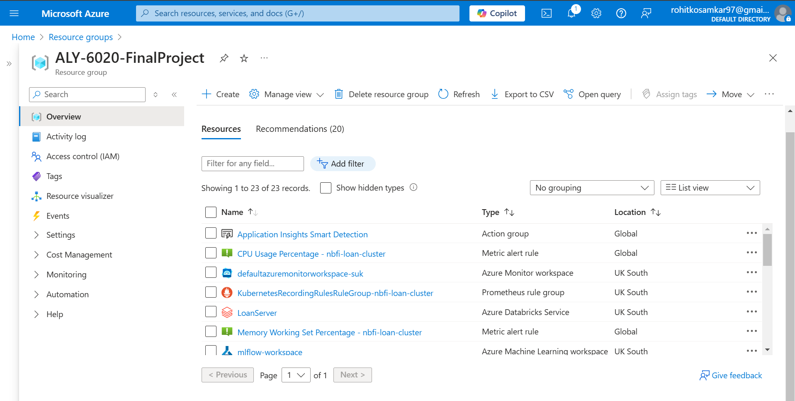
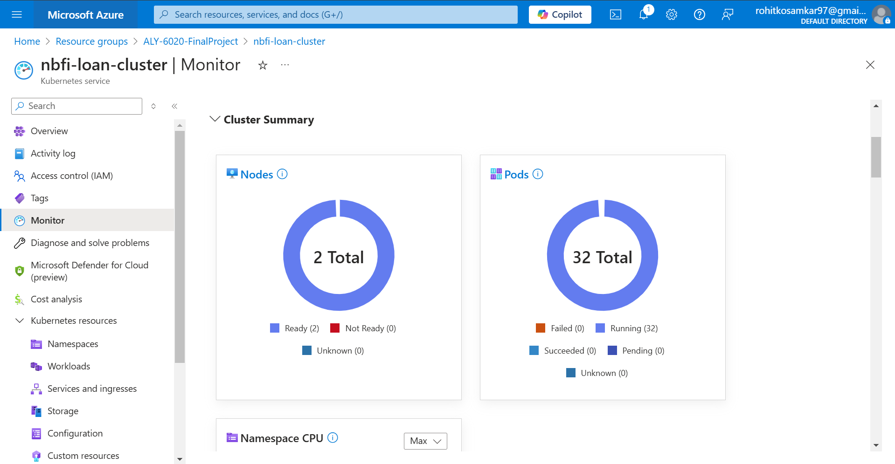
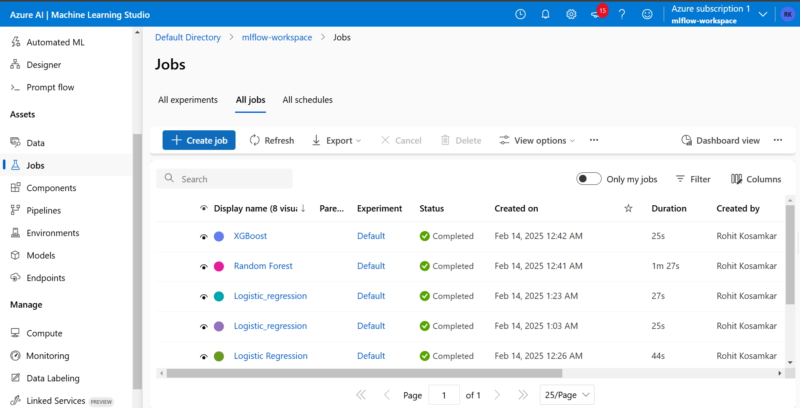

## Welcome to the Ultimate MLOps-Powered Loan Default Prediction System! 

The financial sector is rapidly evolving, and Non-Banking Financial Institutions (NBFIs) are at the forefront of innovation. As digital lending grows, accurate loan default prediction has become critical for risk management and financial stability.

This repository presents an End-to-End MLOps Architecture for Loan Default Prediction designed to automate the entire machine learning lifecycle—from data ingestion to model deployment and monitoring—leveraging the power of Azure Cloud.

By implementing MLOps best practices, this solution enhances model reliability, scalability, and reproducibility—making it ready for real-world deployment in financial services.

## High Level Architecture

## Project Demo

## 🏗️ Architecture Overview
The project follows the **Medallion Architecture** implemented using **Azure SQL Database** for structured data processing. The flow involves **three main data layers**:

### **1️⃣ Bronze Layer (Raw Data Ingestion)**
- Data is collected from multiple sources and **stored in the Azure SQL Database**.
- Data is extracted from CSV files and **loaded into the `bronze.Bronze_Customer` table**.
- **Azure Data Factory (ADF)** is used for **incremental loading** into Azure SQL.

### **2️⃣ Silver Layer (Data Cleaning & Preprocessing)**
- Data is cleaned and transformed in **Python (pandas)** in a **local environment**.
- Cleaned data is loaded into **`silver.Silver_Customer` table** in Azure SQL.
- **Databricks is used for transformations** to ensure high-quality structured data.

### **3️⃣ Gold Layer (Feature Engineering & Model Training)**
- Feature engineering is performed on the **silver layer data**.
- Transformed data is stored in the **gold layer (`gold.Gold_Customer` table)**.
- The model training pipeline uses **MLflow for experiment tracking** and logs the best models.

## 🏆 Model Training & Deployment (Azure ML Studio & MLflow)
### **Model Training Steps**
1. **Data Extraction**: Load the `gold.Gold_Customer` table for model training.
2. **Preprocessing**: Apply **feature scaling, encoding**, and missing value handling.
3. **Model Training**: Train multiple models using **Logistic Regression, XGBoost, and LightGBM**.
4. **MLflow Integration**: Store models as **artifacts in Azure ML Studio**.
5. **Model Selection**: Choose the best-performing model and **register it in MLflow**.

## 🚀 Containerization & Docker
- The best model is **retrieved from Azure ML Studio** and packaged inside a **Flask Web API**.
- The API is **containerized using Docker** and pushed to **Azure Container Registry (ACR)**.
- The `Dockerfile` ensures that dependencies are installed correctly and the Flask app runs smoothly.

## 🔐 Service Principal Authentication
- **Azure Service Principal** is used to **securely access Azure ML & ACR**.
- The service principal credentials are stored in a **Kubernetes Secret** for authentication.

## 🏗️ Deployment on Azure Kubernetes Service (AKS)
- **Azure Kubernetes Service (AKS)** is used to **deploy the containerized model**.
- Steps involved:
  1. Create an **AKS Cluster**.
  2. Deploy the **Flask API as a Kubernetes pod**.
  3. Use **LoadBalancer service** to expose the API.
  4. Store **environment variables** securely using **Kubernetes Secrets**.

## 📊 Storing Predictions in Azure SQL DB
- Every model prediction is **stored in the `Predictions` table**.
- The stored data includes:
  - `run_id` (MLflow Run ID)
  - `client_id` (User Identifier)
  - `input_raw_data` (JSON format)
  - `processed_data` (Final model input)
  - `prediction_probability`
  - `predicted_class`
  - `prediction_timestamp`

## 📡 Monitoring & Logging
- **Azure Monitor & Log Analytics** track API performance and error logs.
- **Application Insights** helps in real-time monitoring of API health.
- **Prometheus & Grafana** are planned for model drift detection.

## 🔄 CI/CD Pipeline (GitHub Actions)
The **CI/CD pipeline automates model deployment** when new code is pushed to GitHub.

### **Steps in the CI/CD Pipeline**
1. **Code Push & Trigger CI/CD**: GitHub Actions trigger on `main` branch commits.
2. **Build & Test**: Runs unit tests, linting, and security scans.
3. **Build Docker Image**: Creates a new image with the latest model.
4. **Push to Azure Container Registry (ACR)**.
5. **Deploy to AKS** using a Kubernetes YAML configuration.
6. **Monitor Deployment Status** using `kubectl` commands.

## 📜 Summary of Azure Services Used
| **Service** | **Purpose** |
|------------|------------|
| **Azure SQL Database** | Stores raw, processed, and prediction data |
| **Azure Data Factory** | Manages data ingestion pipelines |
| **Azure Databricks** | Performs data transformations and feature engineering |
| **Azure ML Studio** | Tracks ML experiments and stores trained models |
| **MLflow** | Handles model versioning and artifact storage |
| **Azure Container Registry (ACR)** | Stores containerized model images |
| **Azure Kubernetes Service (AKS)** | Deploys and scales the application |
| **Azure Monitor** | Logs API requests, errors, and performance metrics |
| **GitHub Actions** | Automates CI/CD workflow |

## 📌 Next Steps & Future Enhancements
- Implement **Model Retraining Pipeline** with **AutoML** in Azure ML.
- Enable **Drift Detection** using **Evidently AI & Prometheus**.
- Extend the system to **streaming data** using **Azure Event Hubs**.

## 🎯 Conclusion
This project demonstrates a **fully automated ML pipeline** from **data ingestion to model deployment** with **Azure services**. It ensures **scalability, security, and automation** for real-world financial applications.

---
**Authors:** [Rohit Kosamkar]

📌 **Repository**: [GitHub Repo](https://github.com/rohit180497/NBFI-Loan-Repayment)

